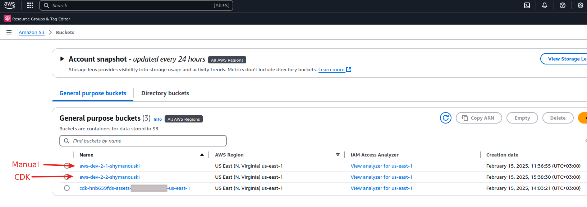
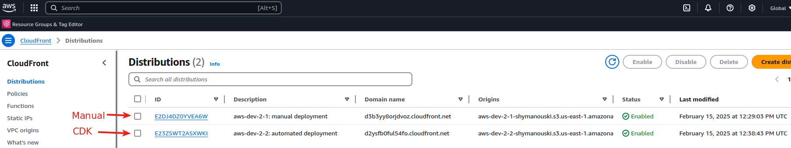
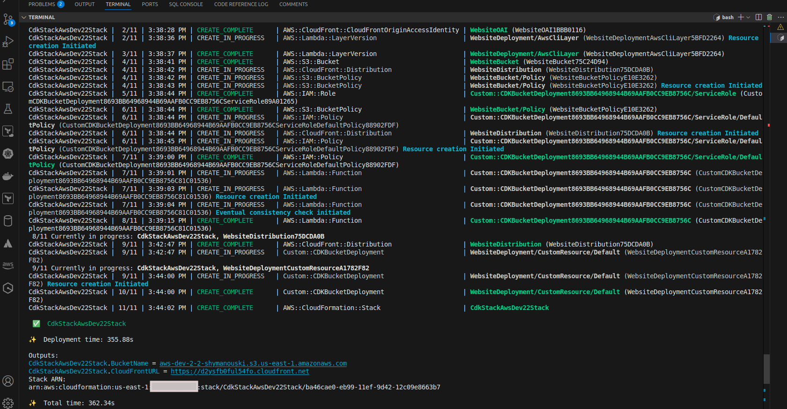

# React-shop-cloudfront

## Task 2 - Serving SPA

URL of instructions: https://github.com/rolling-scopes-school/aws/blob/main/aws-developer/02_serving_spa/task.md

What has been done:
  - [x] Manual Bucket and CloudFront creation is done
  - [x] Automatic Bucket and CloudFront creation with deployment is done

Manual creation
- Bucket URL: https://aws-dev-2-1-shymanouski.s3.us-east-1.amazonaws.com
- CloudFront URL: https://d3b3yy8orjdvoz.cloudfront.net

Automatic creation (using CDK)
- Bucket URL: http://aws-dev-2-2-shymanouski.s3.us-east-1.amazonaws.com
- CloudFront URL: https://d2ysfb0ful54fo.cloudfront.net

Additionally:
- The display of product images was fixed according to the following advice of @SunSundr: https://discord.com/channels/1018779355155013693/1084767995341058128/1339524661175648278

Screenshots:

1. Buckets configuration

2. Cloudfront configuration

3. CDK Deploy command line output

