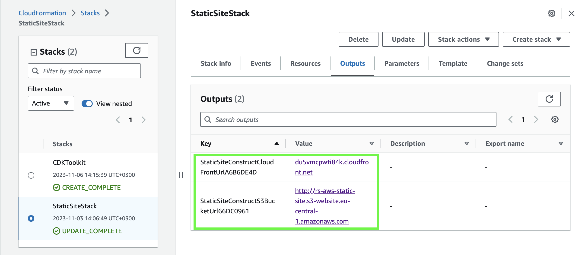

# React-shop-cloudfront

This is frontend starter project for nodejs-aws mentoring program. It uses the following technologies:

- [Vite](https://vitejs.dev/) as a project bundler
- [React](https://beta.reactjs.org/) as a frontend framework
- [React-router-dom](https://reactrouterdotcom.fly.dev/) as a routing library
- [MUI](https://mui.com/) as a UI framework
- [React-query](https://react-query-v3.tanstack.com/) as a data fetching library
- [Formik](https://formik.org/) as a form library
- [Yup](https://github.com/jquense/yup) as a validation schema
- [Vitest](https://vitest.dev/) as a test runner
- [MSW](https://mswjs.io/) as an API mocking library
- [Eslint](https://eslint.org/) as a code linting tool
- [Prettier](https://prettier.io/) as a code formatting tool
- [TypeScript](https://www.typescriptlang.org/) as a type checking tool

## NPM Scripts

* `start` - Starts the project in dev mode with mocked API on local environment.

* `build` - Builds the project for production in `dist` folder.

* `preview` - Starts the project in production mode on local environment.

* `test`, `test:ui`, `test:coverage` - Runs tests in console, in browser or with coverage.

* `lint`, `prettier` - Runs linting and formatting for all files in `src` folder.

# AWS CDK Stack

AWS CDK code is written in Typescript (located at `./cdk`) and compiled using ESBuild: [patched AWS CDK Workshop](https://github.com/hazardsoft/aws-cdk-workshop) is used as a template taking into account that Lambda functions will be developed as ESM in the next tasks.

## Important Notes

### Legacy Entries

There are discrepancies between AWS Console and AWS CDK API in handling some CloudFront configuration provided by default:

1. AWS Console encourages use of `Origin access control settings (recommended)` but AWS CDK uses `Legacy access identities` while configuring CloudFront origin;

2. AWS Console encourages use of `Cache policy and origin request policy (recommended)` but AWS CDK uses `Legacy cache settings` while configuring CloudFront default behavior.

To address both issues AWS CDK template is updated manually (please see changes for [CloudFront origin](https://github.com/hazardsoft/nodejs-aws-shop-react/blob/task-2/cdk/StaticSiteConstruct.ts#L58-L59) and [CloudFront behavior](https://github.com/hazardsoft/nodejs-aws-shop-react/blob/task-2/cdk/StaticSiteConstruct.ts#L62-L65))

## NPM scripts

* `cdk` - Builds/runs AWS CDK project (no need to call manually, it's used in `cdk.json` config file);

* `cdk:diff` - Runs AWS CDK diff command to illustrate how local template is different to a deployed one (in order to use a user's profile the script needs to be run as `npm run cdk:diff -- --profile={profile_name}`)

* `cdk:deploy` - Runs AWS CDK deploy command to deploy stack (in order to use a user's profile the script needs to be run as `npm run cdk:deploy -- --profile={profile_name}`)

* `cdk:destroy` - Runs AWS CDK destroy command to destroy previously deployed stack (in order to use a user's profile the script needs to be run as `npm run cdk:destroy -- --profile={profile_name}`)

## Deployment

In order to deploy application stack with AWS CDK one needs to run the following commands:
1. `npm run build`
2. `npm run cdk:deploy` (in order to use a user's profile the script needs to be run as `npm run cdk:deploy -- --profile={profile_name}`)

## AWS CDK Outputs

To simplify verification of deployed stack corresponding outputs are added to the stack as can be seen at the image below (Both outputs are provided below as well to simplify cross-check verification).

### CloudFront

Static website is served via CloudFront distribution available at https://du5vmcpwti84k.cloudfront.net/

### S3 Bucket Url

CloudFront uses S3 Bucket as the origin at http://rs-aws-static-site.s3-website.eu-central-1.amazonaws.com/ (not available directly, S3 bucket's policy allows CloudFront distribution to get objects)