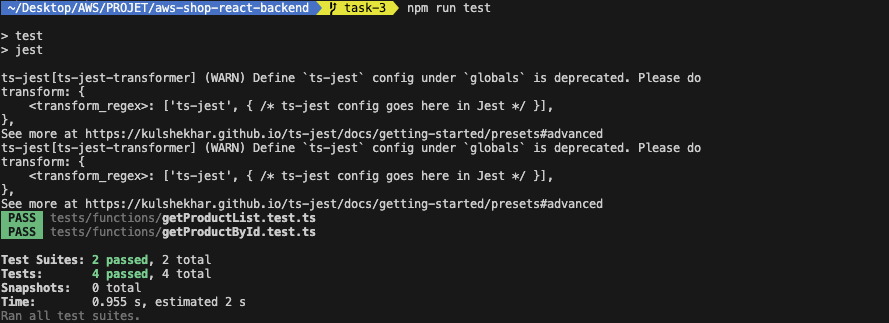
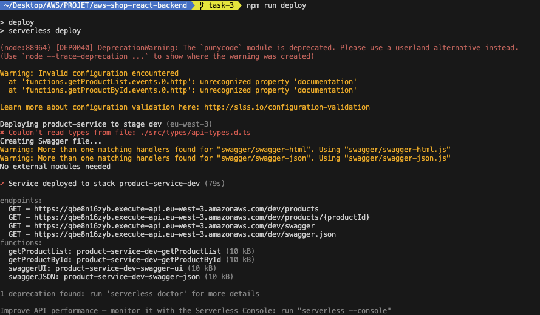
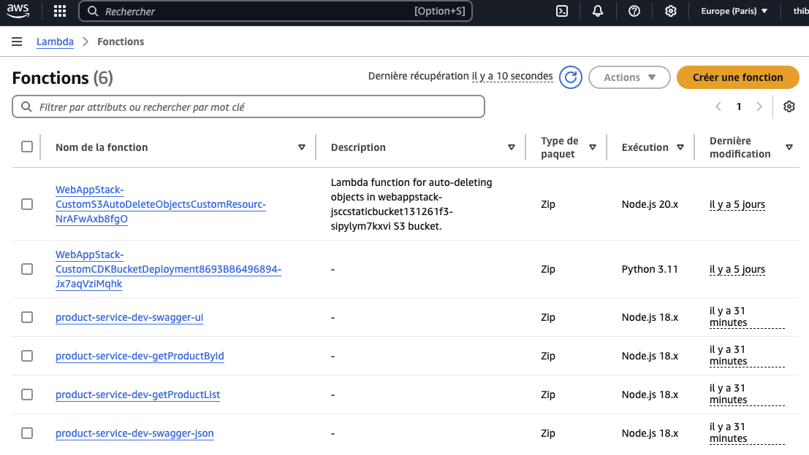

# React-shop-cloudfront

## Task 3 - Lambda + serverless

URL of instructions: https://github.com/rolling-scopes-school/aws/blob/main/aws-developer/03_serverless_api/task.md

What has been done:
  - [x] Code is separated in 2 repositories: frontend (https://github.com/akiavara/nodejs-aws-shop-react) and backend (https://github.com/akiavara/aws-shop-react-backend)
  - [x] Code of the backend repository in MR (https://github.com/akiavara/aws-shop-react-backend/pull/1/files)
  - [x] getProductsList lambda function: https://qbe8n16zyb.execute-api.eu-west-3.amazonaws.com/dev/products
  - [x] getProductsById lambda function: https://qbe8n16zyb.execute-api.eu-west-3.amazonaws.com/dev/products/2
  - [x] getProductsById error handled if product not found : https://qbe8n16zyb.execute-api.eu-west-3.amazonaws.com/dev/products/2222
  - [x] Swagger : https://qbe8n16zyb.execute-api.eu-west-3.amazonaws.com/dev/swagger
  - [x] Swagger JSON : https://qbe8n16zyb.execute-api.eu-west-3.amazonaws.com/dev/swagger.json

Here are screenshots of what I did.

1. Unit tests in backend repo

2. Deployment result in backend repo

3. Display in "Lambda" AWS

4. Local website display

## Task 2 - Serving SPA

URL of instructions: https://github.com/rolling-scopes-school/aws/blob/main/aws-developer/02_serving_spa/task.md

What has been done:
  - [x] Manual Bucket + CloudFront creation: done
  - [x] Automatic Bucket + CloudFront creation: done

Manual creation
- Bucket URL (Access Denied): https://nodejs-aws-shop-react-tds.s3.eu-west-3.amazonaws.com/
- CloudFront URL: https://djy4jsds0nb88.cloudfront.net/

Automatic creation (using CDK)
- Bucket URL (Access Denied, see "infrastructure/lib/infrastructure-stack.ts") : https://webappstack-jsccstaticbucket131261f3-sipylym7kxvi.s3.eu-west-3.amazonaws.com/
- CloudFront URL: https://d1ef84ecychojy.cloudfront.net

Here are screenshots of what I did.

1. Buckets configuration

2. Cloudfront configuration

3. CDK Bootstrap command line output

4. CDK Deploy command line output

## Old README

This is frontend starter project for nodejs-aws mentoring program. It uses the following technologies:

- [Vite](https://vitejs.dev/) as a project bundler
- [React](https://beta.reactjs.org/) as a frontend framework
- [React-router-dom](https://reactrouterdotcom.fly.dev/) as a routing library
- [MUI](https://mui.com/) as a UI framework
- [React-query](https://react-query-v3.tanstack.com/) as a data fetching library
- [Formik](https://formik.org/) as a form library
- [Yup](https://github.com/jquense/yup) as a validation schema
- [Vitest](https://vitest.dev/) as a test runner
- [MSW](https://mswjs.io/) as an API mocking library
- [Eslint](https://eslint.org/) as a code linting tool
- [Prettier](https://prettier.io/) as a code formatting tool
- [TypeScript](https://www.typescriptlang.org/) as a type checking tool

### Available Scripts

#### `start`

Starts the project in dev mode with mocked API on local environment.

#### `build`

Builds the project for production in `dist` folder.

#### `preview`

Starts the project in production mode on local environment.

#### `test`, `test:ui`, `test:coverage`

Runs tests in console, in browser or with coverage.

#### `lint`, `prettier`

Runs linting and formatting for all files in `src` folder.
